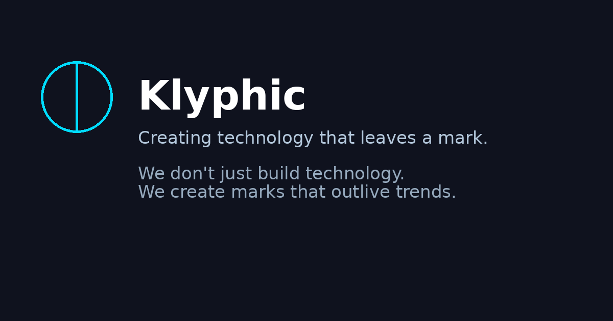

# Klyphic

> **Creating technology that leaves a mark.**

------------------------------------------------------------------------

# About

Klyphic is a technology company built around one simple idea:

> **Technology should leave a lasting mark, not just solve today's
> problems.**

The name comes from the idea of a **glyph**---a symbol that survives
generations and preserves meaning. Klyphic aims to build software, AI
systems, automation platforms, developer tools, and future technologies
that continue creating value long into the future.

## Mission

-   Build meaningful software.
-   Advance AI and intelligent automation.
-   Create products that developers enjoy using.
-   Build systems that stand the test of time.
-   Leave a legacy through technology.

## Vision

To become a technology ecosystem where every product reflects quality,
innovation, and long-term thinking.

## Core Values

-   Innovation
-   Reliability
-   Security
-   Simplicity
-   Long-term Impact

------------------------------------------------------------------------

# Team

## Founder

### Shantanu Patel

**Founder • Lead Developer**

Responsible for: - Product Vision - Backend Development - AI Systems -
Automation - System Architecture - Research & Development

## Developers

  Name             Role
  ---------------- -------------------------------------
  Pujesh Reddy     Developer
  Arsh Tyagi       Developer
  Ekansh           Developer
  Durgesh Thakur   Developer
  Chahat           Developer

------------------------------------------------------------------------

# Brand Philosophy

> We don't just build software.

> We build technology that becomes a lasting symbol.

> **Klyphic --- Creating technology that leaves a mark.**
